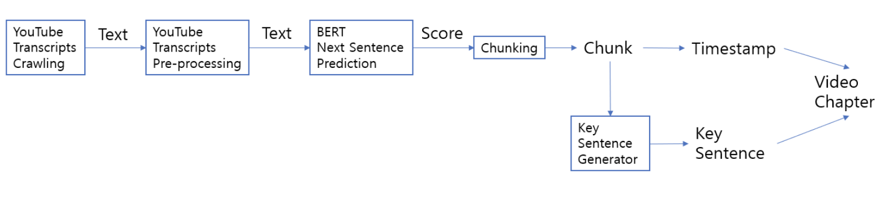

# 0. CodeFest 2020
해당 프로젝트는 [KC-ML2](https://www.kc-ml2.com/)에서 개최한 [CodeFest2020](https://blog.kc-ml2.com/codefest2020/)에 참가하여 진행한 내용입니다.

# 1. VideoChapterCreator
Automatic Video Chapter Creator with BERT NextSentencePrediction and KeySentenceGenerator

## 1.1 Introduction

Introducing **V**ideo **C**hapter creato**R**

Video Chapter creatoR(abbreviated **VCR**) is a technology that automatically creates chapters of videos. Videos, especially in the field of education, typically are long and tend to be one-shot-made. These videos are convenient to make in the aspect of video creator, however, not very efficient in the aspect of learner. 

There can be various purposes for learners to watch certain education video. For example, one might want to know every single details of the video. He or she can just watch the whole video and will be satisfied. 

*However*, other learners might not be sure whether he/she should watch this video or not, or might just want to skim through the video to search for few topics. For learners explained above, one-shot-made video, without any timeline that explains when this film deals with which topic, is inefficient. VCR is created, in order to solve this inefficiency.

## 1.2 Pipeline


## 1.3 Code Review
### 1.3.1 Package Import
```
!pip install youtube_transcript_api
!pip install transformers

!python -m spacy download en
!git clone https://github.com/lovit/textrank
```

### 1.3.2 Transcripts, NSP
### 1.3.3 Key Sentence Generator
### 1.3.4 Video Chapter creatoR

### 1.4 Limitation and Improvement

Currently, VCR only works on English transcripts. This technology does not support other languages yet. More and more languages will be supported soon. 

Also, we only support videos uploaded on Youtube, so videos should first be uploaded on Youtube before using this technology. 

We hope that by fine tuning on BERT, the quality of chunks - by quality, it means chunks that contain exactly one topic - can be improved. Proper evaluation method for the quality of the chunk is also needed. To mention about Key Sentence Generator, if there is better model to use instead, topic sentences can be more orderly, with proper length.


